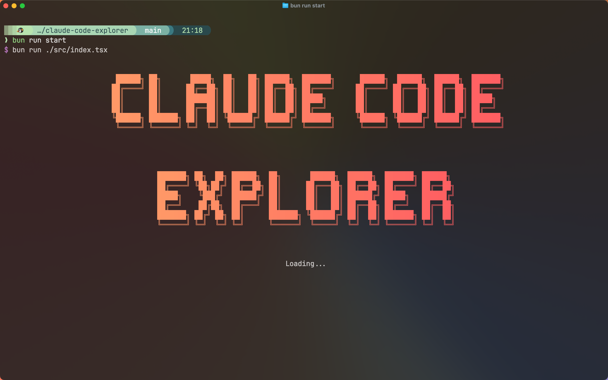
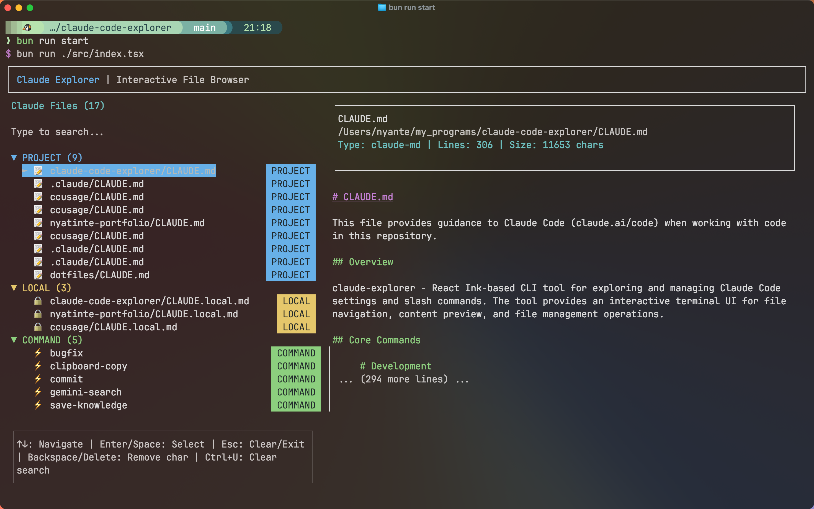

# Claude Explorer

<div align="center">
  
  <br><br>
  <strong>Interactive CLI tool for exploring and managing Claude Code settings and slash commands</strong>
</div>

## Overview

**Claude Explorer** is a React Ink-based CLI tool that provides an interactive terminal interface for discovering, previewing, and managing Claude Code configuration files and slash commands. Navigate through your codebase to find CLAUDE.md files, slash command definitions, and other Claude-related configurations with a beautiful terminal UI.

## Features

- 🔍 **Interactive File Discovery** - Automatically finds Claude Code configuration files
- 📁 **Split-pane Interface** - File list on the left, preview on the right
- ⌨️ **Keyboard Navigation** - Arrow keys, Enter, ESC for smooth navigation
- 🔎 **Live Search** - Filter files as you type
- 📋 **File Actions** - Copy content, copy paths, open files in default applications
- 🎨 **Terminal UI** - Beautiful React Ink interface with proper focus management
- 📝 **Markdown Preview** - Renders CLAUDE.md files with syntax highlighting

## Screenshots

<div align="center">
  
  <br><br>
  
</div>

## Target Files

Claude Explorer automatically discovers these configuration files:

- **CLAUDE.md** → Project-level configuration (most common)
- **CLAUDE.local.md** → Local overrides (gitignored)
- **~/.claude/CLAUDE.md** → Global user configuration
- **.claude/commands/**/*.md** → Slash command definitions

## Installation

### Recommended: Direct execution

```bash
# Run without installing
bunx claude-code-explorer
# or
npx claude-code-explorer
```

### Optional: Global installation

```bash
npm install -g claude-code-explorer
# Then run anywhere
claude-code-explorer
```

## Usage

### Interactive Mode (Default)

```bash
claude-code-explorer                    # Launch interactive TUI
claude-code-explorer --path ~/projects # Scan specific directory
```

### Command Line Options

```bash
claude-code-explorer --help             # Show help information
claude-code-explorer --version          # Show version number
claude-code-explorer --path <path>      # Specify directory to scan
```

### Examples

```bash
# Interactive exploration of current directory
claude-code-explorer

# Scan specific project directory
claude-code-explorer --path /path/to/project

# Show help
claude-code-explorer --help

# Show version
claude-code-explorer --version
```

### Development Mode

```bash
bun run start      # Run with hot reload
bun run dev        # Development mode with watch
```

### Building

```bash
bun run build      # Build for production
```

## Keyboard Shortcuts

- **↑/↓** - Navigate file list
- **Enter** - Open file actions menu
- **ESC** - Close menu / Exit
- **Tab** - Switch between panes
- **/** - Focus search input
- **c** - Copy file content (in menu)
- **p** - Copy file path (in menu)
- **o** - Open file in default application (in menu)

## Development

### Tech Stack

- **Runtime**: Bun + Node.js (>= 20)
- **UI Framework**: React Ink v6
- **Components**: @inkjs/ui for enhanced terminal components
- **Build**: tsdown (Rolldown/Oxc) with shebang executable
- **Testing**: vitest + ink-testing-library
- **Linting**: Biome with strict rules
- **Type Safety**: TypeScript with ultra-strict configuration

### CLI Reference

| Option      | Short | Description           | Default           |
| ----------- | ----- | --------------------- | ----------------- |
| `--help`    | `-h`  | Show help information | -                 |
| `--version` | `-V`  | Show version number   | -                 |
| `--path`    | `-p`  | Directory to scan     | Current directory |

### Development Commands

```bash
# Quality pipeline
bun run ci                    # Full CI pipeline
bun run typecheck            # TypeScript checking
bun run check:write          # Auto-fix formatting
bun run test                 # Run all tests
bun run test:watch           # Test in watch mode

# Development
bun run start                # Run CLI in development
bun run dev                  # Development with watch
bun run build                # Build for production
```

### Architecture

- **InSource Testing** - Tests alongside source code
- **Branded Types** - Compile-time and runtime type safety
- **React Ink Components** - Terminal UI with proper focus management
- **Pattern Matching** - File type detection with ts-pattern
- **Immutable Design** - Readonly properties throughout

## Contributing

1. Fork the repository
2. Create a feature branch
3. Make your changes
4. Run the quality pipeline: `bun run ci`
5. Submit a pull request

## License

MIT License - see LICENSE file for details
